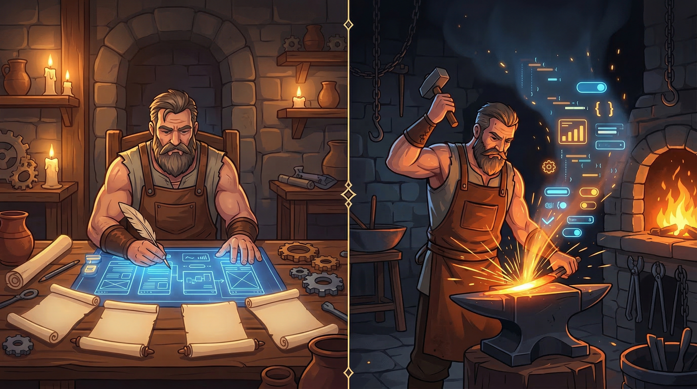

<div align="center">


<h1>🔨 Forge</h1>

<p><strong>El código mediocre se genera. El gran software se forja.</strong></p>

<p>
Un <em>factory OS</em> multi-plataforma que <strong>planifica antes de construir</strong>:<br>
de la idea a una app SaaS production-ready, sobre un stack perfeccionado, con el agente de IA que ya usás.
</p>

<p>
<a href="./CHANGELOG.md"></a>


</p>

<p>
<a href="#quick-start"><strong>Quick start</strong></a> ·
<a href="#comandos"><strong>Comandos</strong></a> ·
<a href="https://lafragua.dev/guide"><strong>Guía del Forjador</strong></a> ·
<a href="./CHANGELOG.md"><strong>Changelog</strong></a>
</p>

</div>

---

```
IDEA  →  /plan  →  Blueprint  →  /build  →  Código production-ready
```

Forge funciona en **Claude Code · Codex · OpenCode · Cursor · Gemini CLI**: el Factory OS (`FORGE.md`) es agnóstico y un solo CLI genera el proyecto para cualquiera de los 5.

> **✨ Nuevo en v5 — La Fundición.** Instalá features production-ready con un comando: `forge cast auth` (Email/Password + Supabase). Merge 3-way, no pisa tu código. Ver [`CHANGELOG.md`](./CHANGELOG.md).

📖 **[Guía completa del Forjador](https://lafragua.dev/guide)** — tutorial paso a paso.

---

## Quick Start

```bash
# 1. Clonar Forge y compilar el CLI (una sola vez)
git clone https://github.com/getforja/forge-pro.git ~/.forge
cd ~/.forge/tools/forge-cli && npm install && npm run build && npm link

# 2. Crear tu proyecto
mkdir mi-app && cd mi-app
forge init && npm install

# (opcional) Instalar un feature pack de La Fundición
forge cast --list          # ver packs disponibles
forge cast auth            # Email/Password Supabase (3-way merge, no pisa tu código)

# 3. Configurar credenciales y arrancar
cp example.mcp.json .mcp.json    # Edita con tus keys
npm run dev

# 4. Abrir Claude Code
claude .
```

> **Primer comando dentro de Claude Code:** `/forge-check` verifica que todo esté listo. Si es tu primera vez, prueba `/onboarding`.

> **¿Vienes de Forge V4.0/V4.1?** Corre `forge doctor` (o `command forge doctor --fix`): V4.2 elimina automáticamente el viejo `alias forge='cp -r …'`/`rsync` que podía sobrescribir código real. El comando ahora es el binario `forge`, no un alias.

<details>
<summary><strong>¿Por qué <code>npm link</code> y no un alias?</strong></summary>

Hasta V4.1, Forge se instalaba como un alias de shell (`alias forge='cp -r …'`) que volcaba la plantilla sobre el directorio actual. Ese modelo, re-ejecutado dentro de un proyecto con código, lo sobrescribía **sin aviso**. Desde V4.2 `forge` es un binario (vía `npm link`) con subcomandos seguros: `forge init` se niega a pisar directorios no vacíos y `forge update` hace un merge que preserva tu código. **No crees un `alias forge`** — taparía el binario.
</details>

<details>
<summary><strong>¿Usas Windows?</strong></summary>

Forge funciona en **Windows nativo** (PowerShell/CMD) — el CLI de Node no requiere WSL.

```powershell
git clone https://github.com/getforja/forge-pro.git $HOME\.forge
cd $HOME\.forge\tools\forge-cli
npm install; npm run build; npm link
```

Luego `forge init` en tu proyecto, igual que en macOS/Linux. Los hooks Tier 1 nativos de Claude funcionan en todas las plataformas; los hooks `.sh` Tier 2 (vía husky) requieren Git Bash o WSL.
</details>

<details>
<summary><strong>¿Qué genera <code>forge init</code>?</strong></summary>

| Archivo | Propósito |
|---------|-----------|
| `CLAUDE.md` | Factory OS — el cerebro del agente |
| `.claude/` | Comandos, skills, agentes, PRPs, templates, design systems |
| `.forge/manifest.json` | Registro para que `forge update` haga merge 3-way determinista |
| `example.mcp.json` | MCPs preconfigurados (necesitas tus propias keys) |
| `src/` | Código fuente con arquitectura Feature-First |
| `package.json` | Next.js 16, React 19, Tailwind 3.4, shadcn/ui, Zustand, Zod |

`forge init` nunca pisa a ciegas: rechaza directorios no vacíos (usa `--force`), rechaza tu `$HOME`, y con `--force` sobre un proyecto real exige confirmación tipeada.
</details>

### Requisitos

- **Claude Code** — CLI de Anthropic instalado y autenticado
- **Node.js 18+**
- **Git**
- **Cuenta Supabase** — para auth y base de datos

### Dónde crear tus proyectos

Tus proyectos van **fuera** del directorio de Forge:

```
~/Proyectos/
├── mi-saas/         ← tu proyecto ✅
└── otro-proyecto/   ← también válido ✅

~/.forge/            ← el repo (no tocar)
```

---

## Cómo Funciona

<p align="center">
  
</p>

### Fase 1: Planifica — `/plan`

Ejecuta **La Herrería**, un pipeline de hasta 10 skills que transforma tu idea en un Blueprint ejecutable:

| # | Skill | Output | ~Tiempo |
|---|-------|--------|---------|
| 0 | Viability Check | Go/No-Go gate | 20 min |
| 1 | Business Model Canvas | `BMC-[nombre].md` | 30 min |
| 2 | Product Definition | `PDR-[nombre].md` | 20 min |
| 3 | Tech Spec | `TECH-SPEC-[nombre].md` | 15 min |
| 4 | UX Research | Personas, journey maps | 40 min |
| 5 | User Stories | Epics + stories INVEST | 30 min |
| 6 | UX Design | IA, patrones, onboarding | 45 min |
| 7 | UI Design Wireframes | Screen flows | 45 min |
| 8 | UI Implementation | Design system + código | 30 min |
| 9 | Security Audit | OWASP, ~200 amenazas | 60 min |
| 10 | Master Blueprint | Plan ejecutable por fases | 45 min |

No tienes que hacerlo todo de una vez — puedes hacer un skill por sesión y retomar con `/avivar`.

### Fase 2: Construye — `/build`

Toma el Blueprint aprobado y te pregunta cómo quieres construir:

| Modo | Ideal para | Cómo funciona |
|------|------------|---------------|
| 🔧 **Build Manual** (El Yunque) | Control total | Fase por fase, con tu aprobación en cada paso |
| 🔨 **Modo Forja** | Velocidad | N agentes en paralelo, cada uno con perspectiva diferente |

---

## Modos de Build

Cuando ejecutas `/plan`, Forge te pregunta qué quieres construir y adapta el pipeline:

| Modo | Skills | Tiempo | Cuándo usarlo |
|------|--------|--------|---------------|
| 🏗️ **SaaS Completo** | 11 + 4 opcionales | 5-8 h | Producto con auth, pagos, seguridad |
| 🚀 **MVP para Validar** | 7 | 2-3 h | Validar hipótesis rápido |
| 🔧 **Herramienta Interna** | 10 | 4-6 h | Dashboards, admin panels, tools de equipo |
| 🎯 **Landing Page** | 4 steps | ~1 h | Página de conversión sin backend |
| 🤖 **Feature con IA** | 7 steps | 2-4 h | Módulo AI para app existente o nueva |

---

## Comandos

### Pipeline principal

| Comando | Qué hace |
|---------|----------|
| `/plan` | Pipeline de planificación completo → Blueprint |
| `/build` | Construcción desde Blueprint aprobado |

### Personalización de proyecto

| Comando | Qué hace |
|---------|----------|
| `/forge-init` | Personaliza CLAUDE.md, README y skills al tipo de proyecto (post-plan) |
| `/forge-activate` | Reactivar skills desactivados por `/forge-init` |

### Setup y navegación

| Comando | Qué hace |
|---------|----------|
| `/forge-check` | Diagnóstico: MCPs, dependencias, hooks, credenciales |
| `/onboarding` | Ruta personalizada según tu experiencia |
| `/avivar` | Retoma sesión anterior (lee `.claude/memory/`) |

### Standalone (sin Blueprint)

| Comando | Qué hace |
|---------|----------|
| `/landing` | Landing page de alta conversión con pipeline anti-AI-slop, CRO copywriting y checkpoint visual |
| `/add-login` | Auth completa con Supabase (Email/Password + RLS) |
| `/add-insforge` | Setup InsForge BaaS: MCP, SDK, auth, profiles table |
| `/add-payments` | Pagos con decision tree Polar vs Stripe |
| `/add-emails` | Emails transaccionales (Resend + React Email + unsubscribe) |
| `/add-mobile` | PWA + push notifications (iOS compatible) |
| `/add-ui-kit` | Component Showcase en `/ui` — biblioteca visual con tokens de marca |
| `/redesign` | Audita diseño existente → reporte → fixes por impacto |

### Diseño y calidad

| Comando | Qué hace |
|---------|----------|
| `/design` | Genera, extrae (Claude Design/URL) o actualiza `DESIGN.md` — source of truth visual |
| `/critique` | Evaluación UX/UI en 10 dimensiones + AI slop detection |
| `/polish` | Micro-refinamientos de calidad visual |
| `/normalize` | Alinea UI con el design system definido |
| `/web-audit` | 150+ checks: Performance, Accessibility, SEO, Best Practices |

### Estrategia de producto

| Comando | Qué hace |
|---------|----------|
| `/brujula` | Product Vision + Strategy Canvas |
| `/precio` | Pricing y monetización + unit economics |
| `/estrella` | North Star Metric |
| `/rivales` | Análisis competitivo + battlecards |
| `/lanzamiento` | Go-to-Market strategy |
| `/metas` | OKRs + Outcome Roadmap |

### Business Intelligence

| Comando | Qué hace |
|---------|----------|
| `/roi` | Dashboard HTML con métricas SaaS (MRR, CAC, LTV) |
| `/graduate` | Evalúa MVP → plan de graduación a SaaS |
| `/kanban` | Tablero Kanban visual por User Story |

### Engineering Workflow

| Comando | Qué hace |
|---------|----------|
| `/despachar` | Ship automático: merge, test, review, commit, push, PR |
| `/inspeccionar` | Review pre-landing: 11 categorías del Golden Path |
| `/temple` | Auditoría full-project: Seguridad + Datos/RLS + Cache + Web → reporte único + Audit Score 0-100 |
| `/fragua-review` | Review de producto con mentalidad founder |
| `/adversarial-review` | 4 agentes atacantes + Codex: seguridad, chaos, edge cases, UX |
| `/retro` | Retrospectiva: métricas, sesiones, streaks, team-aware |

### Review Loop

| Comando | Qué hace |
|---------|----------|
| `/review-loop` | Implementa + revisión independiente con Codex (4 agentes en paralelo) |
| `/cancel-review` | Cancela loop activo |

### Meta

| Comando | Qué hace |
|---------|----------|
| `/audit-tokens` | Auditoría de eficiencia de tokens — 8 checks + score 0-100 + top 5 fixes |
| `/autoresearch` | Auto-optimización de skills (patrón Karpathy) |
| `/video-visuals` | Genera visuales estilo sketchnote para marketing |

### Lifecycle

| Comando | Qué hace |
|---------|----------|
| `/update-forge` | Actualiza Forge a la última versión |
| `/eject-forge` | Remueve Forge, deja solo tu código |

---

## Stack (Golden Path)

Un solo stack perfeccionado. Sin opciones, sin decisiones técnicas.

| Capa | Tecnología |
|------|------------|
| Framework | Next.js 16 + React 19 + TypeScript |
| Estilos | Tailwind CSS 3.4 + shadcn/ui |
| Backend | Supabase (Auth + PostgreSQL + RLS) |
| AI Engine | Vercel AI SDK v5 + OpenRouter |
| Validación | Zod |
| Estado | Zustand |
| Testing | Playwright MCP |
| Deploy | Vercel |

### Arquitectura Feature-First

```
src/
├── app/                  # Next.js App Router
│   ├── (auth)/           # Rutas de autenticación
│   └── (main)/           # Rutas principales (protegidas)
├── features/             # Organizadas por funcionalidad
│   └── [feature]/
│       ├── components/   # UI de la feature
│       ├── hooks/        # Custom hooks
│       ├── services/     # Business logic + API
│       ├── types/        # TypeScript types
│       └── store/        # Zustand store slice
└── shared/               # Código reutilizable cross-feature
    ├── components/       # Button, Card, Input...
    ├── ui/               # Design system (Skill #8)
    ├── hooks/            # useDebounce, etc.
    ├── lib/              # supabase.ts, utils
    └── types/            # Tipos compartidos
```

---

## MCPs

Configura en `.mcp.json` (copia de `example.mcp.json`). Nunca commitees `.mcp.json`.

### Core

| MCP | Para qué | Credenciales |
|-----|----------|-------------|
| **Next.js DevTools** | Errores build/runtime en tiempo real | — |
| **Playwright** | Validación visual automática | — |
| **Supabase** | DB, migraciones, RLS, auth | `SUPABASE_PROJECT_REF` + `SUPABASE_ACCESS_TOKEN` |
| **shadcn/ui** | Buscar e instalar componentes | — |

<details>
<summary><strong>MCPs opcionales</strong></summary>

**Assets Creativos**

| MCP | Para qué | Credenciales |
|-----|----------|-------------|
| SVGMaker | SVGs con IA | `SVGMAKER_API_KEY` |

**Desarrollo**

| MCP | Para qué | Credenciales |
|-----|----------|-------------|
| Chrome DevTools | Debugging avanzado del browser | — |
| Sequential Thinking | Razonamiento estructurado | — |

**Infraestructura**

| MCP | Para qué | Credenciales |
|-----|----------|-------------|
| GitHub | Repos, issues, PRs | `GITHUB_PERSONAL_ACCESS_TOKEN` |
| Stripe | Productos, precios, webhooks | `STRIPE_SECRET_KEY` |
| Sentry | Errores en producción | `SENTRY_AUTH_TOKEN` |
| Resend | Email flows | `RESEND_API_KEY` |

**Research**

| MCP | Para qué | Credenciales |
|-----|----------|-------------|
| Perplexity | Deep research con IA | `PERPLEXITY_API_KEY` |
| Brave Search | Research rápido | `BRAVE_API_KEY` |
| Firecrawl | Web scraping | `FIRECRAWL_API_KEY` |
| n8n | Automatizaciones | `N8N_API_URL` + `N8N_API_KEY` |

> **Gestión de contexto:** Máximo **10 MCPs habilitados** y **80 tools activas** por proyecto. Desactiva MCPs no usados con `disabledMcpServers` en `.mcp.json`.

</details>

---

## Skills

### Bundled (incluidos en Forge)

| Skill | Qué hace |
|-------|----------|
| `la-herreria` | Pipeline de planificación — el cerebro de `/plan` |
| `la-forja` | Ejecución paralela — N agentes sandbox con personalidades |
| `karpathy-principles` | 4 principios de codificación (Karpathy) con ejemplos Forge |
| `skill-creator` | Guía para crear skills compatibles |
| `impeccable` | Design Quality Engine — AI slop detection, 3 dials configurables |
| `web-quality` | 150+ checks Lighthouse — Performance, A11y, SEO |

<details>
<summary><strong>Skills externos (opcionales)</strong></summary>

```bash
# Impeccable — 17 comandos de diseño adicionales
npx skills add pbakaus/impeccable

# Web Quality — 6 skills de auditoría
npx skills add addyosmani/web-quality-skills

# Agency Agents — 61 agentes especializados
# github.com/msitarzewski/agency-agents

# gstack — Browser QA + Testing (~100ms por comando)
git clone https://github.com/garrytan/gstack.git ~/.claude/skills/gstack
cd ~/.claude/skills/gstack && ./setup
# Requiere: Bun v1.0+
```
</details>

---

## Agentes

12 agentes especializados coordinados por `/build`:

| Agente | Especialidad |
|--------|-------------|
| `frontend-specialist` | React, Next.js, Tailwind, UI |
| `backend-specialist` | API routes, lógica de negocio |
| `supabase-admin` | DB, migraciones, RLS, auth |
| `codebase-analyst` | Arquitectura, refactoring |
| `db-architect` | Schema design, indexación, queries |
| `validacion-calidad` | Testing, Playwright, QA |
| `testing-engineer` | Unit tests, integration tests |
| `vercel-deployer` | Deploy, variables de entorno |
| `design-critic` | Evaluación UX/UI |
| `qa-auditor` | A11y + Performance + Security |
| `observability-engineer` | Logging, Sentry, health checks |
| `gestor-documentacion` | Docs técnicos del proyecto |

---

## Landing Page (`/landing`)

Pipeline copy-first con detección anti-AI-slop integrada. Genera landing pages que no parecen hechas por IA.

```
/landing
  → Step 1: Definición Rápida (10 min) — 14 preguntas de discovery
  → Step 2: Copywriting & Mensajería (20 min) — copy ANTES de código
  → Step 3: Diseño Visual (25 min) — anti-AI-slop activado
  → ✓ Checkpoint: Review Anti-IA (21 puntos)
  → Step 4: SEO & Deploy (5 min)
```

<details>
<summary><strong>Qué incluye el pipeline</strong></summary>

| Componente | Archivo | Qué hace |
|------------|---------|----------|
| CRO Copywriting | `copywriting-cro.md` | Framework de mensajería, headlines, CTAs, psicología de conversión |
| Anti-AI-Slop | `landing-anti-slop.md` | 10 indicadores de "esto lo hizo IA" + alternativas premium |
| Premium Components | `premium-components.md` | Referencia de componentes de alta calidad (21st.dev, Landingfolio) |
| Checkpoint Visual | Integrado en Step 3→4 | Checklist de 21 puntos: visual, copy y técnico |

**Reglas clave:**
- Copy primero, código después — nunca al revés
- Tipografía con personalidad (serif para headlines, no solo Inter)
- Layout asimétrico con bento grid, no el grid genérico de 3 columnas
- Mobile-first obligatorio (375px+)

</details>

---

## Review Loop

Revisión independiente con Codex multi-agente (4 agentes en paralelo).

```
/review-loop <tarea>
  → Claude implementa
  → Codex revisa (Diff, Holistic, Next.js, UX)
  → Claude aborda el feedback
```

<details>
<summary><strong>Setup y uso</strong></summary>

```bash
# Setup (una sola vez)
npm install -g @openai/codex
export OPENAI_API_KEY="sk-..."

# Uso
/review-loop añadir paginación a la tabla de usuarios
/cancel-review    # Cancelar loop activo
```

Output: `reviews/review-[YYYYMMDD-HHMMSS-hex].md` con severidades 🔴🟠🟡🟢

</details>

### Adversarial Review

Revisión adversarial que intenta activamente **romper** tu código con 4 agentes atacantes.

```
/adversarial-review [scope opcional]
  → El Intruso (OWASP Top 10, injection, auth bypass, IDOR)
  → El Caos (race conditions, cascadas, memory leaks)
  → El Destructor (boundary values, unicode, prototype pollution)
  → El Saboteador (doble-click, back button, offline, DevTools)
```

Output: `reviews/adversarial-[YYYYMMDD-HHMMSS-hex].md` con Resilience Score (0-100) + vectores resistidos

---

## Hooks

7 hooks fail-open que automatizan calidad y seguridad durante el build.

| Hook | Qué hace |
|------|----------|
| `pre-commit-validation` | TypeScript typecheck antes de commit |
| `security-scan` | Detecta secretos, CORS `*`, debug statements |
| `auto-format` | Prettier automático al editar |
| `test-runner` | Tests relacionados al archivo editado |
| `tool-usage-tracker` | Tracking de uso por sesión |
| `log-tool-usage` | Audit log de herramientas |
| `stop-hook` | Review Loop al terminar sesión |

**Activar:** `cp .claude/example.settings.json .claude/settings.json`

Todos los hooks son fail-open: si fallan inesperadamente, aprueban la acción.

---

## Design Systems

<p align="center">
  
</p>

Forge incluye dos capas:

### 1. Patrones de estilo (5, agnósticos de marca)

| Sistema | Estética |
|---------|---------|
| `neobrutalism` | Bold, bordes duros, colores saturados |
| `bento-grid` | Grids asimétricos, estilo Apple |
| `neumorphism` | Soft UI, sombras sutiles |
| `liquid-glass` | Transparencias, efecto iOS |
| `gradient-mesh` | Gradientes fluidos con texturas |

### 2. Library de marcas (129, importadas de open-design)

129 `DESIGN.md` portables inspirados en marcas reconocidas: Linear, Stripe, Vercel, Apple, Notion, Tesla, Anthropic, Cursor, Supabase, Cohere, Mistral, ElevenLabs, Spotify, Webflow, Sanity, Airbnb, Datadog, GitHub, Sentry, Cloudflare, ClickHouse, MongoDB, y muchas más en 18 categorías.

Cuando le digas a Claude "quiero estilo Linear", lee `library/linear-app/DESIGN.md` (con paleta exacta, tipografía, posture) y lo usa como hint — no improvisa de memoria.

**Catálogo:** [`.claude/design-systems/library/INDEX.md`](.claude/design-systems/library/INDEX.md)
**Atribución:** [`.claude/design-systems/library/ATTRIBUTION.md`](.claude/design-systems/library/ATTRIBUTION.md) — Apache-2.0, importado de [`nexu-io/open-design`](https://github.com/nexu-io/open-design)

> Estos sistemas son **referencia para discutir, no plantilla a clonar**. El objetivo es inspirar, no replicar.

### 5 Visual Directions deterministas (en `/add-ui-kit`)

Cuando ejecutas `/add-ui-kit` y no tienes marca clara, el Discovery muestra 5 direcciones pre-curadas con palette OKLch + font stack + posture ya resueltos: Editorial Monocle · Modern Minimal · Warm & Soft · Tech Utility · Brutalist Experimental. Un click → 80% del resultado en 30 segundos sin parálisis.

---

## DESIGN.md — Source of Truth Visual

`DESIGN.md` es el archivo portable de decisiones de diseño. Vive en el root del proyecto junto a `CLAUDE.md` y es consumido por Claude Design (handoff bundle), el skill Impeccable, y todos los comandos de diseño.

```
DESIGN.md (root del proyecto)
├── 1. Visual Theme & Atmosphere
├── 2. Color Palette & Roles
├── 3. Typography Rules
├── 4. Component Stylings
├── 5. Layout Principles
├── 6. Motion & Animation            ← Extensión Forge
├── 7. Anti-AI-Slop Markers          ← Extensión Forge
└── 8. Design System Notes           ← Para regenerar pantallas
```

| Cuándo se genera | Cuándo se consume |
|-------------------|-------------------|
| `/plan` (Skill #8 — UI) | `/critique`, `/polish`, `/normalize` |
| `/design` (standalone) | `/landing`, `/build` |
| Extracción desde Claude Design | Design Critic agent |

Portable a Claude Design, AI Studio, Antigravity o cualquier agente que respete markdown semántico. Un solo `DESIGN.md` viaja entre diseño y código.

---

## Tips Rápidos

| Atajo | Qué hace |
|-------|----------|
| `Ctrl+U` | Borra la línea |
| `@` | Referenciar archivos |
| `Shift+Enter` | Input multilínea |
| `Esc Esc` | Interrumpir / restaurar |
| `/compact` | Compactar contexto |
| `/fork` | Tarea paralela |

```bash
# Git Worktrees — múltiples Claudes en ramas distintas
git worktree add ../feature-x feature-x

# tmux — procesos largos
tmux new -s dev
```

---

## Lifecycle

```bash
forge self-update   # actualizar tu instalación de Forge (~/.forge): sync + rebuild
/update-forge       # actualizar la tooling de Forge en ESTE proyecto (= forge update)
/eject-forge        # remover Forge, dejar solo tu código
```

> Para actualizar tu clon usá `forge self-update` (o `git fetch && git reset --hard origin/main` + rebuild). **No uses `git pull`** — forge-pro es un mirror force-pusheado y divergiría.

---

<div align="center">

**Forge v5.3.1** · [github.com/getforja/forge-pro](https://github.com/getforja/forge-pro) · MIT

*Planificá primero. Construí con confianza.*

</div>
